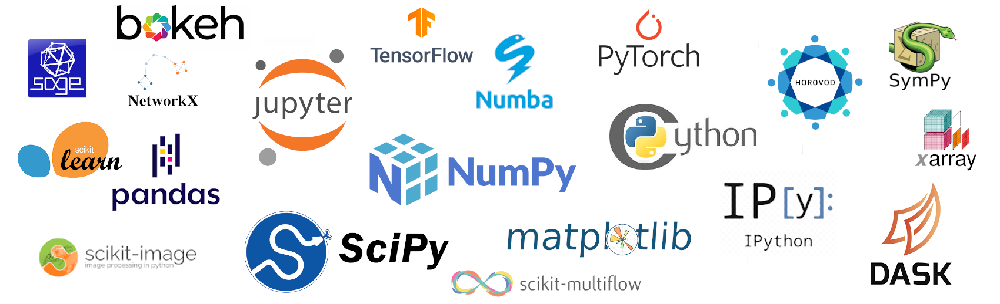
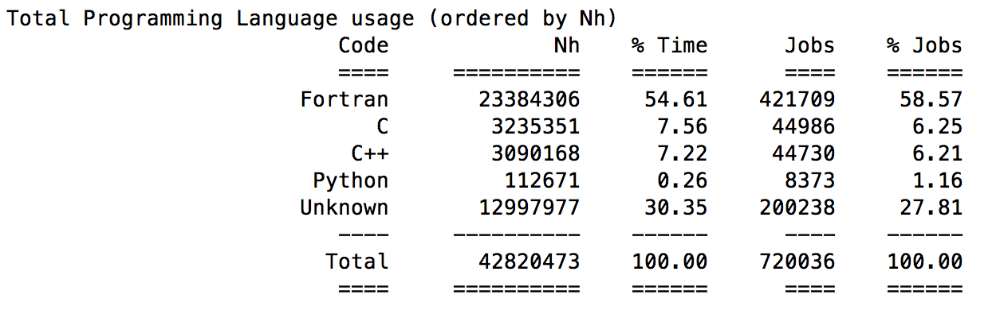
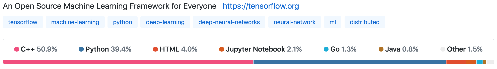
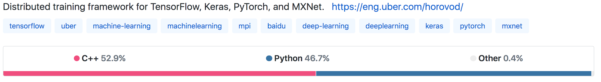
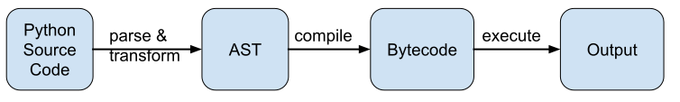
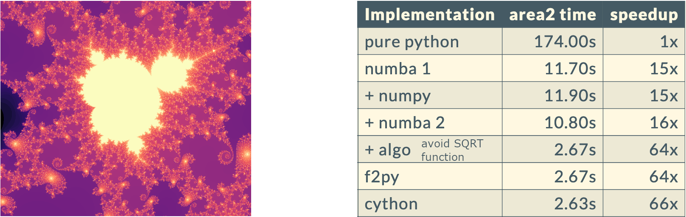

template:titleslide

# Python for High-Performance Computing
## a (brief!) overview
Presenter: Neelofer Banglawala, EPCC

---

# Python
 
.center[]

https://xkcd.com/353

---

# Overview

We will (briefly!) cover:

- The role of Python in HPC

- Why Python is slow (compared to compiled C/C++/Fortran)

- Python performance tips for fast numerical computing
 - serial and parallel code

- Python frameworks for HPC

---

name:questionpython
# Why Python?

Because Python is...
 - easy to read and write (concise, minimal syntax)
 - flexible with a rich set of features for imperative, functional, object-oriented & procedural programming
 - extensible by interfacing other languages e.g. C (ctypes), Fortran (f2py)
 - extensible by leveraging a rich ecosystem of third-party libraries & tools
 - used everywhere, is open source and supported by a large community!

.center[]

---

template:questionpython

... but how about in HPC?

---

name:questionpython
# Python for HPC?

Programming language usage on ARCHER\* by node hours (Nh) for January 2018 - March 2019\*\*:

.center[]

\*UK's National Supercomputing Service (2014 - 2021), \*\*only for applications run using parallel job launcher

Python is not really used for parallel computation in an HPC context...

---

template: questionpython
...*or is it?*

---

# Python for HPC!

2015 EuroSciPy: **"Massively parallel implementation in Python of a pseudo-spectral DNS code for turbulent flows"**
[M. Mortensen]

- ~100 lines of Python with **NumPy**, using **MPI4PY** over MPI
- Scaled to over a thousand cores on Shaheen (IBM BlueGene/P at KAUST)
- Python-only solver almost as performant as C++ DNS solver 
- *Optimized* Python solver as good as C++ DNS solver ...

2018 Gordon Bell Prize: **"Exascale Deep Learning for Climate Analytics"** [T. Kurth et al.]

- Ran **TensorFlow** on Summit (Top500 #1, Nov. 2018) 
- Distributed across 27360 V100 GPUs using **Horovod** over MPI
- Sustained 0.3 exaflop/s (single precision) @ 90% parallel efficiency

But is this massively-parallel computing with *Python* ...?

---

# Python for HPC...

.center[... Yes and No]

- *Optimized* Python DNS solver (+ libraries) depends on more than just Python...
- As for Tensorflow and Horovod...

.center[]

.center[]

.center[Why? Because Python can be slow...]

---

# Python for HPC

- Intensive core compute typically done in a compiled language
 - DNS Solver: C++ fftw lib (plus Cython)
 - Tensorflow: C++ (plus CUDA)

- Python does "everything else":
 - data preprocessing
 - formulating model
 - data staging & distribution
 - postprocessing / analysis of results
 - visualisation

This is how Python is typically used in HPC:
- As a convenient "glue" tying different stages of workflow together
- Calling (compiled) non-Python code for fast execution of performance-critical kernels

---

# Why is Python slow?

Python code executed by a Python interpreter (typically: CPython's "`python`")
 - Interpreter *parses* and *compiles* code to produce bytecode
 - Interpreter acts as a *virtual machine* to execute bytecode

.center[]

Interpreter can perform some basic (but limited) optimisations
 - Dynamic typing prevents potential optimisations, even if type is known
 - Intentional: executes code immediately, does not spend time optimising

.center[Running bytecode instructions through the Python interpreter is slower
than executing compiled, statically-typed Fortran/C/C++ code]

---

# Does Python performance matter?

Is it worth understanding Python performance programming? Yes!

Python components in an HPC application may be tightly coupled with core, non-Python compute code

- Use Python efficiently tp prevent it becoming a performance bottleneck

- Know what options exist for improving performance so can choose the best strategy

- Understand how to exploit the full numerical computing power of Python before anything else

.center[Why write slow code when you can write fast code, sometimes without much more effort?]

---
name:basictips
# Python performance: the basics

Use Python's numerical computing software stack
 - Python's core numerical computing software stack: NumPy, SciPy, Pandas
 - Provides highly optimised data structures and functionality

Stand on the shoulders of (software development) giants
 - Use functionality from standard Python library modules and external packages (reuse, don't reinvent)
 - Libraries are optimised for performance: functions implemented in C instead of Python will be *much* faster

Know language (and library) overheads
 - Avoid explicit `for` loops, use vectorization
 - Use efficient array access syntax
 - Avoid repeated access to global variables
 - Some library functions more expensive than others...
 - *Extra tip*: NumExpr can help speed up NumPy expressions

---
# But wait!

Before you start optimising your python code:

### Profile, profile and profile some more!

Many ways to profile Python code
 - Baseline profiling of small code chunks with `timeit` (or `%timeit` iPython magic)
 - `cProfile` (or `%prun`) for function calls (built-in profiler, low overhead) 
  - can visualise profiling results with SnakeViz
 - see also: `line_profiler`, `memory-profiler` 

#### "Measure, don't guess"

Profile your code to identify compute "hotspots" and memory bottlenecks

Back to Python performance tips...

---

# Python performance: next steps

Use "just-in-time" (JIT) compilation
- **Numba**: JIT compilation using LLVM toolchain
 - Add JIT-decorator to functions to compile "just-in-time"
 - Use on functions called many times
- **PyPy**: alternative Python interpreter ('`pypy`' instead of CPython's '`python`')
 - Attempts various optimisations of Python interpreter
 - Limited scope: only covers core Python functionality

Interface compiled languages
- **CPython extension modules**: extend CPython interpreter with C code
 - CPython and NumPy provide a C API to write C code (or C++ with restrictions) that extends CPython 
 - Import as Python module after compiling
- **Cython**: make existing Python code fast by making it more like C
 - Like CPython extension, but automates much of CPython extension module creation
- **Pythran**: Python-to-C++ translator (Python modules --> native C++11)
- **f2py**: Fortran-to-Python interface generator (from NumPy)

---

# Python performance: parallelise

Add parallelism! (It's HPC after all...)

Shared memory
 - **Multithreading**: Python threads managed by OS
  - Global Interpreter Lock (GIL) contention: one thread can execute bytecode via interpreter at any time
  - However compiled extension modules can thread without GIL
  - on HPC resources, NumPy, SciPy calls threaded high-performance math libraries
 - **Cython + OpenMP**: access OpenMP using Cython's `cimport` syntax
  - `nogil=True` key to threaded performance
 - **Numba**: automatically attempts to parallelise jit-decorated functions
  - or request: `@jit(parallel=True, nopython=True)`
  - some support for offloading to GPUs

---

# Python performance: parallelise

Distributed memory
 - **Multiprocessing**: one instance of Python interpreter per subprocess
  - no GIL contention!
  - Explicit communication between processes (`pickle` Python objects)
 - **MPI** 
  - MPI4PY most common and mature library, but there are others
   - Overhead for pickling/unpickling Python objects
   - No pickling of (contiguous memory) Numpy arrays - performant!
 - **Dask**: parallel data collections (larger-than-memory or distributed)
  - extends NumPy arrays, Pandas Dataframes and so on
  - See also Dask-ML for scalable machine learning in Python
 - **Horovod**: distributed deep learning training framework
  - with CPUs (MPI) or GPUs (Nvidia)
  - Tensorflow, Keras, PyTorch, MXNET supported

And more...
 - PyTorch (torch.distributed) ...

---

# Performance optimisation in action

Systematic profiling and optimisations can lead to significant improvements.
For example, speed up of serial code that creates Mandelbrot set:   (Wolfgang Resch, NIH High Performance Computing Group)

.center[]

For this example (+ parallel optimisations): https://hpc.nih.gov/training/handouts/171121_python_in_hpc.pdf

For details on Python performance tips (+ more examples): https://epcced.github.io/APT-python4hpc/

See also: https://github.com/csc-training/hpc-python

---

# The dreaded import problem

Python does many small file operations as it locates all the files it needs during startup. 
On HPC resources with large, shared filesystems, many such metadata-heavy operations at the same time
can strain the file system.

Possible solutions:
- Containerize Python interpreter
- For MPI processes: import in the root process and sharefiles via MPI
- Static python builds
- Cache the shared objects or python packages

See:
- NERSC talk (2013): https://www.nersc.gov/assets/Uploads/GroteNUG2013.pdf
- NERSC paper (2012): https://cug.org/proceedings/attendee_program_cug2012/includes/files/pap124.pdf
- Python MPI bcast: https://github.com/rainwoodman/python-mpi-bcast
- Static python: https://github.com/bfroehle/slither/blob/master/README.md
- Scalable python: https://github.com/CSCfi/scalable-python

[Slide from: https://hpc.nih.gov/training/handouts/171121_python_in_hpc.pdf]

---

# Python frameworks for HPC

- **PyCOMPSs**: task-based framework (Barcelona Supercomputing)
 - Decorate functions to be run as asynchronous parallel tasks
 - Runtime system exploits inherent concurrency in code and detects data dependencies between tasks
 - "PyCOMPSs: Parallel computational workflows in Python", E. Tejedor et al., 2015, doi: 10.1177/1094342015594678

- **Legate (NumPy)**: framework for accelerated and distributed array computing
 - Leverages performance and scalability of the Legion runtime
 - Good scalability of NumPy programs (1280 CPU cores, 256 GPUs)
 - Get 1 to 2 orders of magnitude better performance than Dask
 - Aimed at advanced users and library developers
 - "Legate NumPy: Accelerated and Distributed Array Computing", M. Bauer and M. Garland, 2019, https://legion.stanford.edu/pdfs/legate-preprint.pdf 

---

# Final remarks

We covered a lot!

Python is great, but know what it can be used for and use it well
- Used for many aspects of numerical computing
- Growing usage in HPC with increasing massively-parallel data analytics
- Dismissed as "slow", but can often make it go (much) faster (profile!)
- Optimising Python can give a performance boost where it is tightly integrated with some applications
- End result: faster code that is easy to use, develop and maintain!

Cutting-edge research is producing fast, scalable frameworks in Python

Additional references:
- "Experiences in Developing a Distributed Agent-based Modeling Toolkit with Python," N. T. Collier, J. Ozik and E. R. Tatara, 2020, doi: 10.1109/PyHPC51966.2020.00006
- Python in the NERSC Exascale Science Applications Program for Data: https://dl.acm.org/citation.cfm?id=3149873

